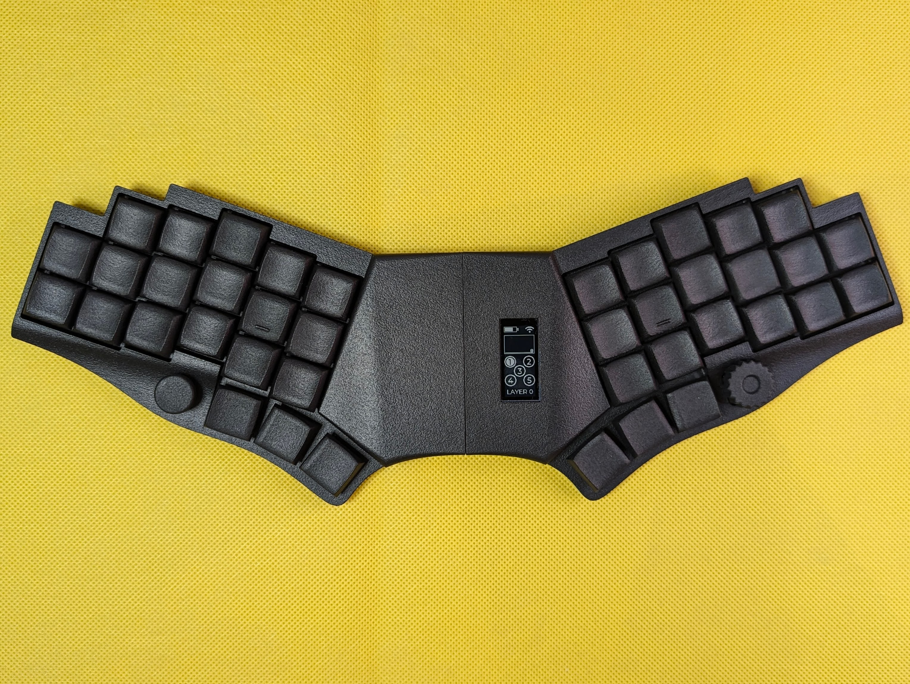
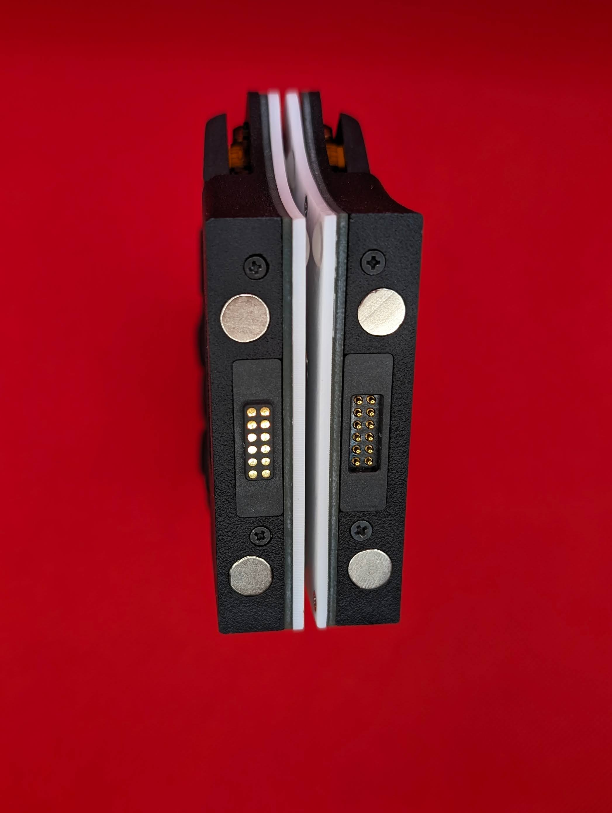

# duet

Wireless unibody portable keyboard.

## Features

- wireless (nice!nano MCU)
- unibody that can be disassembled into two parts for traveling
- 40 Choc V1 switches
- 1 rotary encoder and 1 five-way switch
- 3D printed case
- nice!view support

## Photos

[...more](./images)

## Firmware

[zmk-config](https://github.com/zzeneg/zmk-config/tree/duet) - my custom keymap, use it for testing only. Fork and create your own keymap instead.

## Instructions

[Build guide](./guide/mx/readme.md)

All files are available in GitHub release.

## Support

If you like my work and want to support my future designs, please consider [sponsorship](https://github.com/sponsors/zzeneg).

#### Sponsors

Thank you very much for your support!

